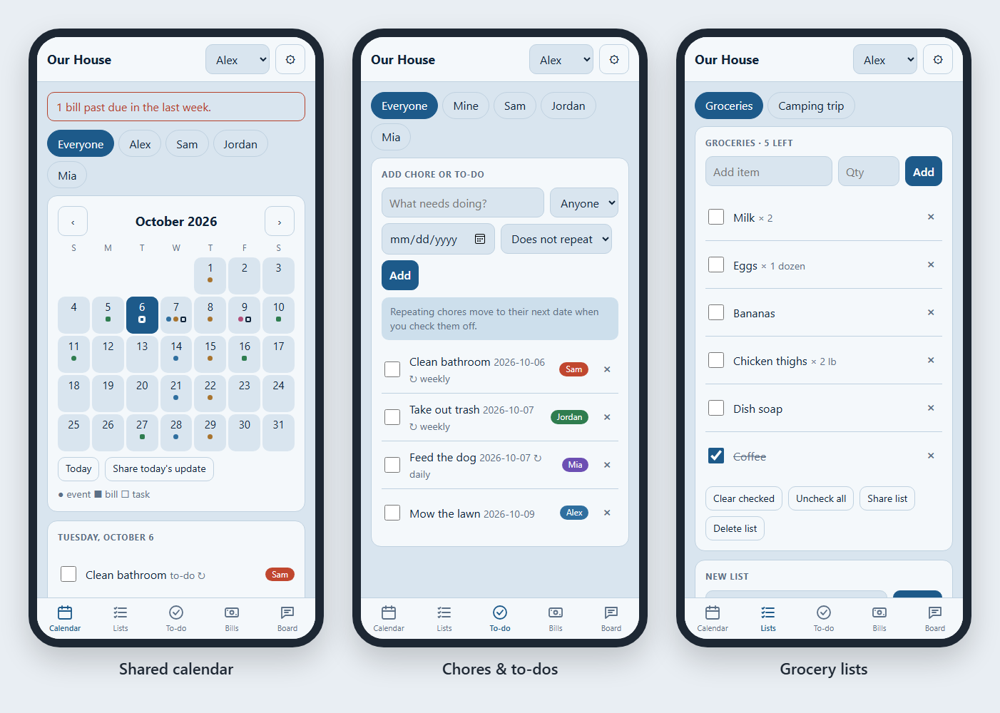
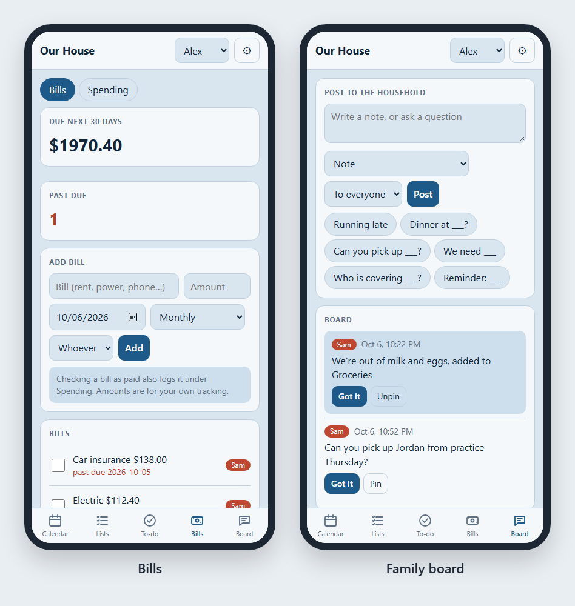
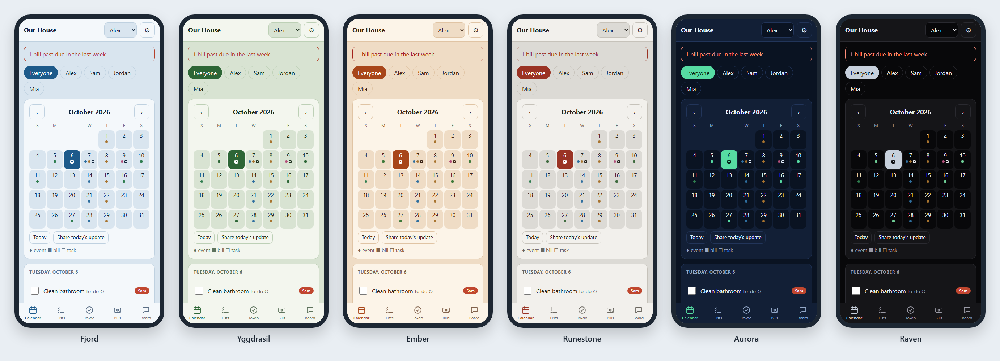

# Ravenhold

**Your household's calendar, chores, grocery lists, bills and messages, all in one place.**

Replace the kitchen whiteboard and the endless group texts. Ravenhold is free, needs no account, and keeps everything on your own device.

### 👉 [Open Ravenhold](https://mentorforge117.github.io/Ravenhold/)

---

## What you can do

| | |
|---|---|
| 📅 **Shared calendar** | Work shifts, school, appointments and family plans, color-coded by person. Repeats daily, weekly, monthly or yearly. |
| ✅ **Chores & to-dos** | Assign chores to anyone. Repeating chores move to their next date when checked off. |
| 🛒 **Lists** | Groceries, packing, routines. Share a list by text in one tap. |
| 💵 **Bills** | See what's due in the next 30 days and what's past due. Track spending by category and person. |
| 💬 **Family board** | Leave notes, pin reminders, and ask someone a question. They'll see a red badge until they answer. |
| 🎨 **Six Norse themes** | Fjord, Yggdrasil, Ember, Runestone, Aurora or Raven. Each phone picks its own. |

---

## Install it on your phone (2 minutes)

Ravenhold runs in your web browser. There's nothing to download from an app store. You add it to your home screen, and it opens like any other app.

### iPhone or iPad
1. Open **[the Ravenhold link](https://mentorforge117.github.io/Ravenhold/)** in **Safari**. (It has to be Safari.)
2. Tap the **Share** button (the square with an arrow pointing up).
3. Scroll down and tap **Add to Home Screen**, then **Add**.
4. From now on, **always open Ravenhold from the home screen icon.**

> ⚠️ On iPhone, the Safari tab and the home screen icon keep *separate* data. Pick the icon and stick with it.

### Android phone or tablet
1. Open **[the Ravenhold link](https://mentorforge117.github.io/Ravenhold/)** in **Chrome**.
2. Tap the **⋮** menu (top right).
3. Tap **Add to Home screen** or **Install app** (the wording depends on your phone).
4. Open Ravenhold from the new icon.

### Laptop or desktop
1. Open **[the Ravenhold link](https://mentorforge117.github.io/Ravenhold/)** in Chrome, Edge, Firefox or Safari.
2. Bookmark it. In Chrome or Edge you can also click **Install** in the address bar.
3. Don't use a private or incognito window. It forgets everything when you close it.

---

## Set up your household (first time)

1. Tap the **⚙ gear** (top right) → **Household**. Name your household and add each person.
2. Use the **name menu** at the top to choose who's using this device.
3. Add the things that repeat first: work shifts, school, chores and monthly bills. That's what makes Ravenhold useful from day one.
4. Use the **Board** for notes and questions. A red number on the Board tab means someone asked you something.

## Share with the rest of your household

Right now each phone keeps its own copy. To bring two phones in sync:

1. **On your phone:** ⚙ gear → **Send my changes** → send the file by text or email.
2. **On their phone:** save the file, then ⚙ gear → **Merge a file from another device** → choose it.
3. Both phones now have the newest version of everything. Do the reverse to send their changes back.

## Keep your data safe

- **Your data never leaves your device.** There's no account and no server, and nobody else can see it, including the person who made Ravenhold.
- That also means **clearing your browser data erases Ravenhold.** Back up once a week: ⚙ gear → **Save backup file**, and keep the file somewhere safe.
- To restore: ⚙ gear → **Replace everything with a backup**.

---

## Good to know

Ravenhold is in **early testing (Alpha)**. Right now:
- No automatic sync between phones yet. Use Send and Merge.
- No notifications or reminders yet.
- Deleting a repeating event removes every date of it.

**Found a problem or have an idea?** [Open an issue](https://github.com/MentorForge117/Ravenhold/issues) or tell the person who sent you the link. Every piece of feedback is read.

---

## Privacy

- Ravenhold has **no accounts, no ads, no tracking and no analytics.**
- Everything you enter is stored only in your browser, on your device. It is never sent to us or anyone else.
- The app page is hosted on GitHub Pages. Like any website, GitHub may keep standard server logs (such as IP addresses) when the page loads. See [GitHub's privacy statement](https://docs.github.com/site-policy/privacy-policies/github-general-privacy-statement).
- When you use "Send my changes," you choose who gets the file and how.

## Disclaimer

Ravenhold is an early test version, provided **as is, without warranty of any kind.** Keep your own backups. Don't rely on it as your only record of bills, appointments or anything important.

---

*Ravenhold is free for personal and household use. © 2026 MentorForge117. All rights reserved.*
